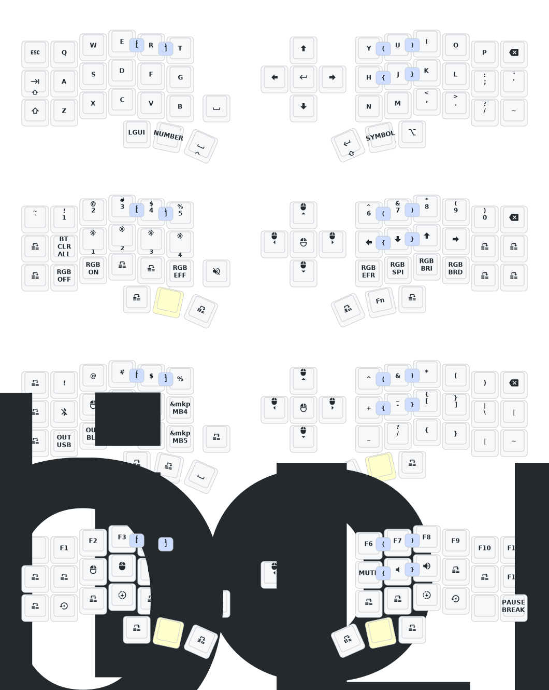

# Corne Keyboard Configs

Welcome to my shrine of split-keyboard wizardry.  
This repo contains the sacred mappings of my Corne — a keyboard so small, it makes laptops look bloated.  

- 🖐️ 42 keys, infinite possibilities.  
- 🧙 I don’t just type, I cast spells.  

If you think QWERTY is enough, you haven’t lived.  

